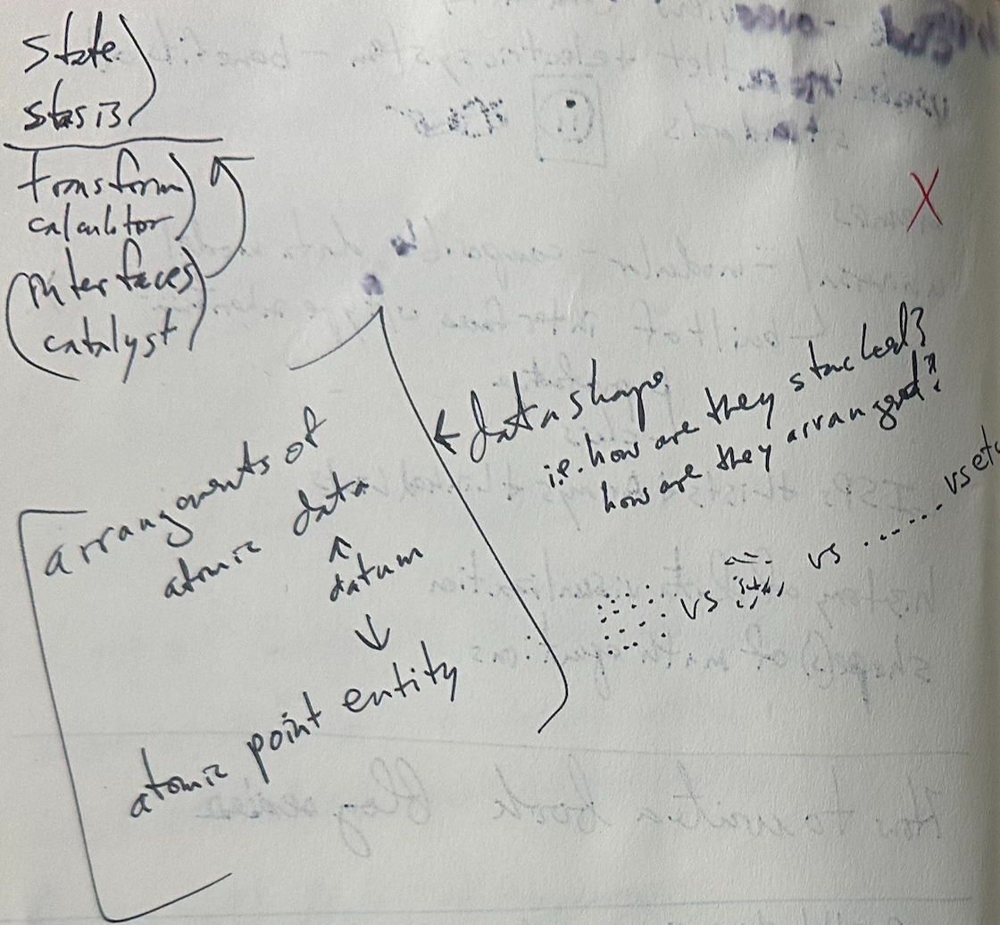
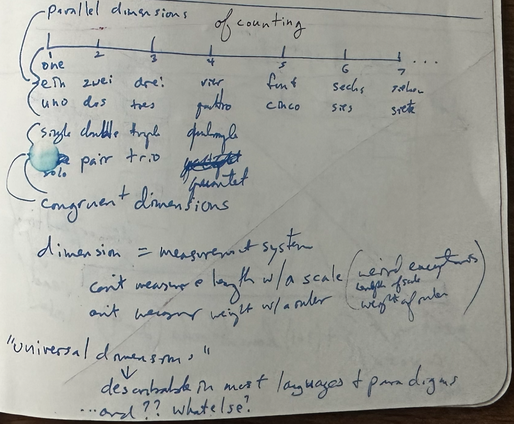
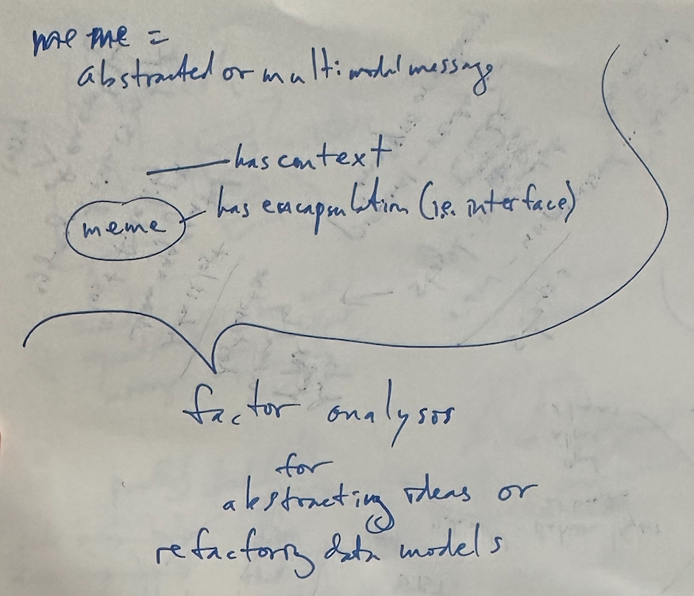

# What is information?

- Information can be thought of as anything that can be stored or transformed--that is anything with a static or dynamic state.
  - Examples:
    - A book
    - A page from a book
    - A letter in a page from a book
    - The paper the book was printed on
    - The glue in the book's binding
    - A rock
    - The rock's surface

- Everything can be conceptualized as information.
- Everything can be thought of as a system or part of a system.
  - Every system has a border
  - If the border of a system is permeable then it has interfaces.
  - #TODO: insert figure showing system vs not system + interface
  - cardinal dimension: unique self-referencing entirety
    - IS the information
      - specific instance including all of its dimensions
      - binary dimension (is or is not the information)
    - approximated by assigned uuid
- A unit of information can be treated as a meme.

- Treat data and information as physical things.
  - Benefits:
    - Can use chemistry approach
    - Can use physics approach
    - Can use engineering approach
  - Data metastructures
    - atomic data
    - molecular data
    - mixtures/solutions of data

- 
- 
- 
- 
-
